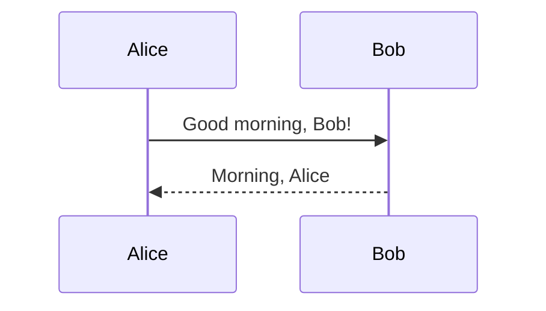
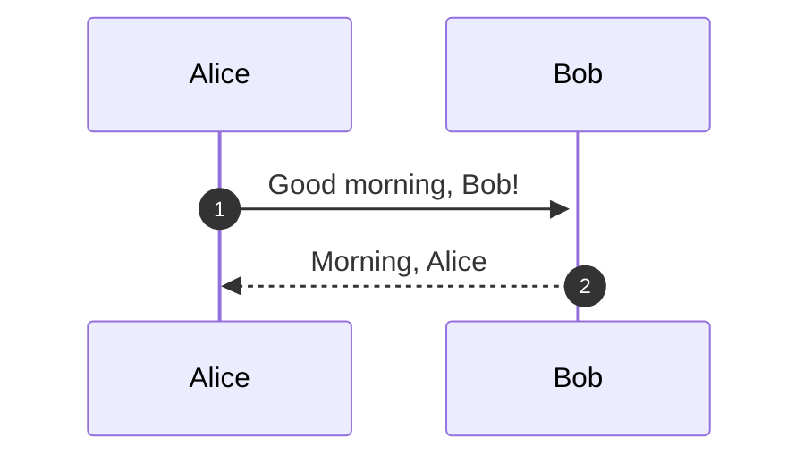
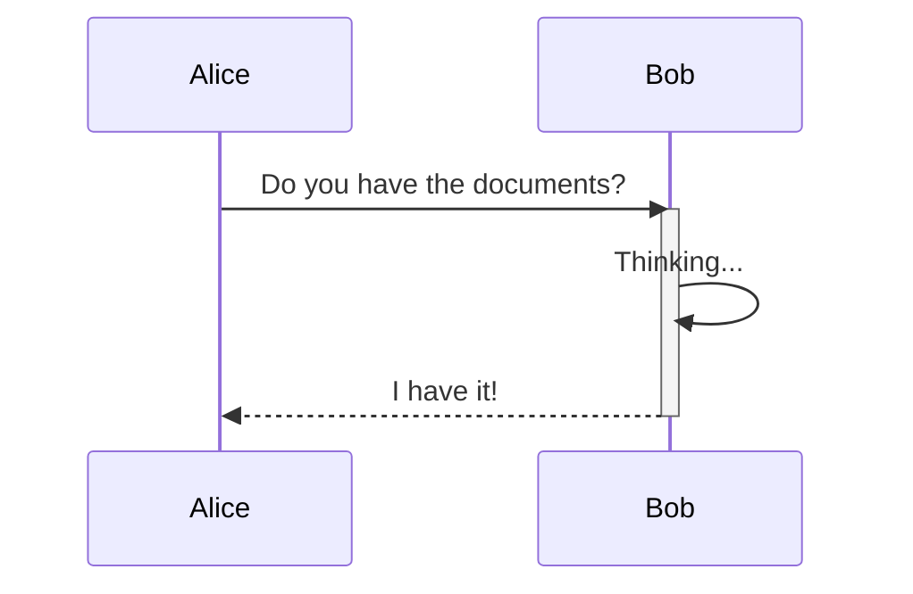
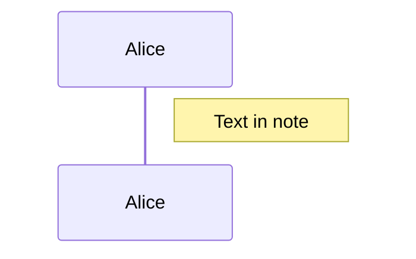
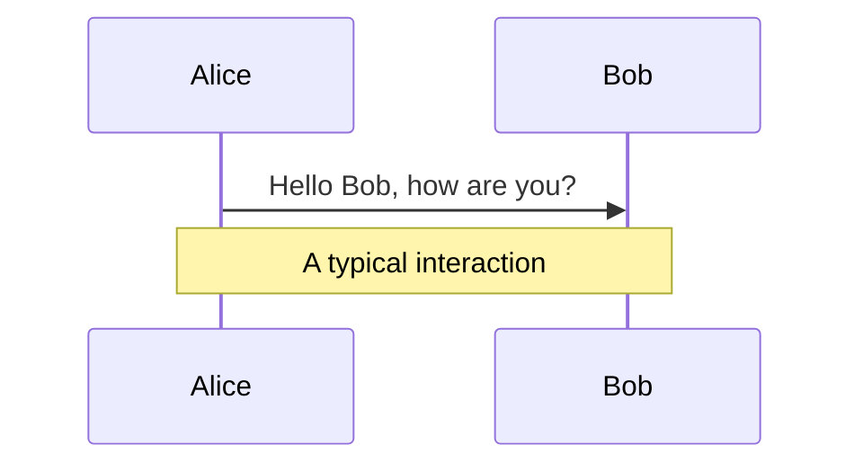
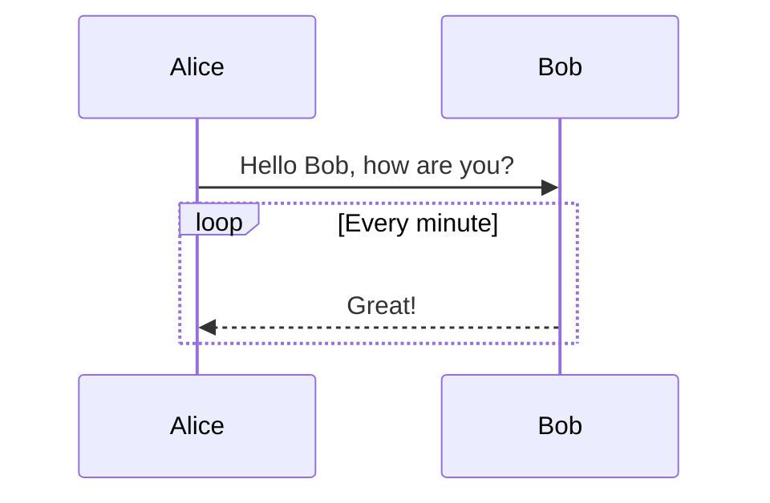
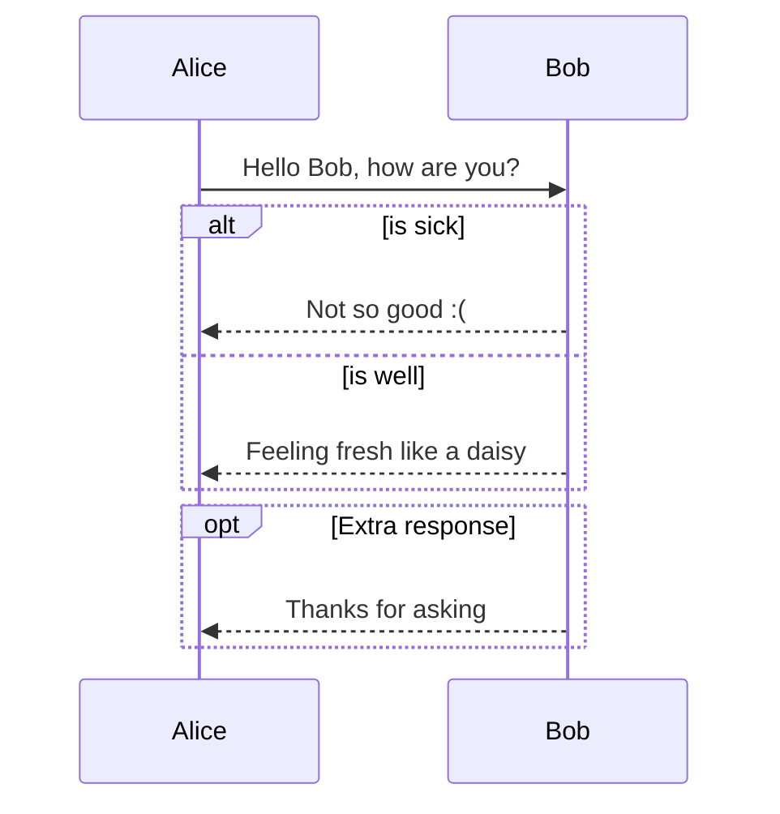
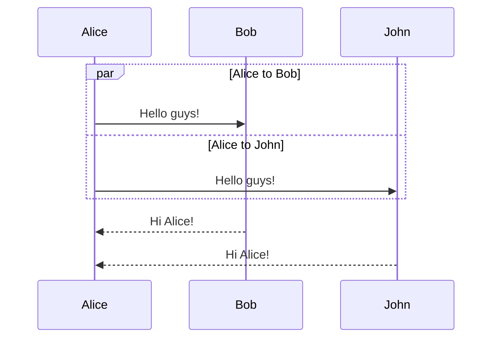
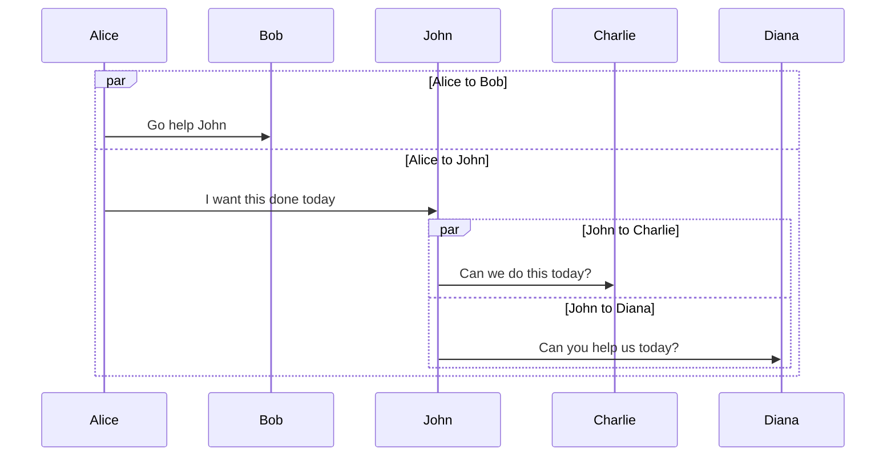

# type-mermaid [](https://github.com/devinoue/type-mermaid/actions/workflows/build.yml)

A library for writing Mermaid code in TypeScript.
With this library, you can easily write Mermaid code using TypeScript and IDE IntelliSense.

**Currently, only sequence diagrams are supported.**

[](https://nodei.co/npm/type-mermaid/)

## Installing

For the latest stable version, run:

```bash
# NPM
npm i type-mermaid

# or Yarn
yarn add type-mermaid

```

## Requirements

- Typescript >=4.9

Be careful with the TypeScript version because it uses the `satisfies` operator.

## Usage

### Simple Mermaid code output

```TypeScript
import { SequenceDiagram, MemberObject } from 'type-mermaid'

const member = {
  Alice: 'participant',
  Bob: 'participant',
} satisfies MemberObject

const { d, render } = SequenceDiagram<keyof typeof member>(member)

// Morning greetings
d.Alice.call.Bob.activate('Good morning, Bob!')
d.Bob.response.Alice.msg('Morning, Alice')

// console output
console.log(render.toString())
```

The basic flow is to use a `d` object (which stands for **diagram**) to create flow, and then use a `render` instance to output mermaid code or image.

### Output

```
sequenceDiagram
    participant Alice
    participant Bob
    Alice->>Bob: Good morning, Bob!
    Bob-->>Alice: Morning, Alice
```

and Mermaid preview.



## SVG output

Using `render` instance, SVG files can also be output.

```typescript
const svgPath = path.join(__dirname, './test.svg')
render.toSvg(svgPath)
```

### MMD file output

```typescript
const mmdPath = path.join(__dirname, './test.mmd')
render.toMmd(mmdPath)
```

## Options

Options for auto numbering(`autonumber`) and indentation can be specified as a string.
By default, indentation is four spaces.

**Example**

```Typescript
import { SequenceDiagram } from '../SequenceDiagram'
import { MemberObject } from '../SequenceDiagram/types'

import path from 'path'

const member = {
  Alice: 'participant',
  Bob: 'participant',
} satisfies MemberObject

const options = {
  autoNumber: true,
  indent: '  ',  //two spaces
}

const { d, render } = SequenceDiagram<keyof typeof member>(member, options)

// Morning greetings
d.Alice.call.Bob.activate('Good morning, Bob!')
d.Bob.response.Alice.msg('Morning, Alice')

console.log(render.toString())

```

**Output**

```
sequenceDiagram
  autonumber
  participant Alice
  participant Bob
  Alice->>+Bob: Good morning, Bob!
  Bob-->>Alice: Morning, Alice
```

by Mermaid



## Activation

There are two ways to express Activation.

**1. Declare `activate` first and code the sequence of events in `then()`.**

In this case, this code will automatically output without writing `deactivate`.

**Example**

```typescript
d.Alice.call.Bob.msg('Do you have the documents?')
d.activate.Bob.then(() => {
  d.Bob.call.Bob.msg('Thinking...')
  d.Bob.response.Alice.msg('I have it!')
})
```

**Output**

```
sequenceDiagram
    participant Alice
    participant Bob
    Alice->>Bob: Do you have the documents?
    activate Bob
    Bob->>Bob: Thinking...
    Bob-->>Alice: I have it!
    deactivate Bob
```



**2. Send a message and activate at the same time.**

In this case, use the `activate()` to send a message. Then you must always use the `deactivate()` to terminate the activation.

**Example**

```typescript
d.Alice.call.Bob.activate('Do you have the documents?')
d.Bob.call.Bob.msg('Thinking...')
d.Bob.response.Alice.deactivate("I've got it!")
```

**Output**

```
sequenceDiagram
    participant Alice
    participant Bob
    Alice->>+Bob: Do you have the documents?
    Bob->>Bob: Thinking...
    Bob-->>-Alice: I've got it!
```


## Notes

It is possible to add notes to a sequence diagram.

**Example**

```typescript
d.note.rightOf.Alice.msg('Text in note')
```

**Output**

```
sequenceDiagram
    participant Alice
    Note right of Alice: Text in note
```



To create notes spanning two participants.

```
d.Alice.call.Bob.msg('Hello Bob, how are you?')
d.note.over.Alice.Bob.msg('A typical interaction')
```

**Output**

```
sequenceDiagram
    participant Alice
    participant Bob
    Alice->>Bob: Hello Bob, how are you?
    Note over Alice,Bob: A typical interaction
```



## Loops

It is possible to express loops in a sequence diagram.

**Example**

```typescript
d.Alice.call.Bob.msg('Hello Bob, how are you?')
d.loop.then('Every minute', () => {
  d.Bob.response.Alice.msg('Great!')
})
```

In `then()`, enter a label and a sequence to repeat.
If no label is needed, the first argument will be an empty character ('').

**Output**

```
sequenceDiagram
    participant Alice
    participant Bob
    Alice->>Bob: Hello Bob, how are you?
    loop Every minute
        Bob-->>Alice: Great!
    end
```



## Alt and Opt

It is possible to express alternative paths in a sequence diagram.

**Example**

```typescript
// Alt
d.Alice.call.Bob.msg('Hello Bob, how are you?')
d.alt.then('is sick', () => {
  d.Bob.response.Alice.msg('Not so good :(')
  d.else.then('is well', () => {
    d.Bob.response.Alice.msg('Feeling fresh like a daisy')
  })
})

// Opt
d.opt.then('Extra response', () => {
  d.Bob.response.Alice.msg('Thanks for asking')
})
```

**Output**

```
sequenceDiagram
    participant Alice
    participant Bob
    Alice->>Bob: Hello Bob, how are you?
    alt is sick
        Bob-->>Alice: Not so good :(
    else is well
        Bob-->>Alice: Feeling fresh like a daisy
    end
    opt Extra response
        Bob-->>Alice: Thanks for asking
    end
```



## Parallel

It is possible to show actions that are happening in parallel.

**Example**

```typescript
// add John
const member = {
  Alice: 'participant',
  Bob: 'participant',
  John: 'participant',
} satisfies MemberObject

const { d, render } = SequenceDiagram<keyof typeof member>(member)

d.par.then('Alice to Bob', () => {
  d.Alice.call.Bob.msg('Hello guys!')
  d.and.then('Alice to John', () => {
    d.Alice.call.John.msg('Hello guys!')
  })
})
d.Bob.response.Alice.msg('Hi Alice!')
d.John.response.Alice.msg('Hi Alice!')
```

`and.then()` should be used within a callback function for `then()`'s second argument.

Multiple `and.then()` can be used.

**Output**

```
sequenceDiagram
    participant Alice
    participant Bob
    participant John
    par Alice to Bob
        Alice->>Bob: Hello guys!
    and Alice to John
        Alice->>John: Hello guys!
    end
    Bob-->>Alice: Hi Alice!
    John-->>Alice: Hi Alice!
```



It is also possible to nest parallel blocks.

**Example**

```typescript
const member = {
  Alice: 'participant',
  Bob: 'participant',
  John: 'participant',
  Charlie: 'participant',
  Diana: 'participant',
} satisfies MemberObject

const { d, render } = SequenceDiagram<keyof typeof member>(member)

d.par.then('Alice to Bob', () => {
  d.Alice.call.Bob.msg('Go help John')
  d.and.then('Alice to John', () => {
    d.Alice.call.John.msg('I want this done today')
    d.par.then('John to Charlie', () => {
      d.John.call.Charlie.msg('Can we do this today?')
      d.and.then('John to Diana', () => {
        d.John.call.Diana.msg('Can you help us today?')
      })
    })
  })
})
```

All participants must be defined by `member`. Otherwise, an error will occur.

**(Because this is TypeScript!).**

**Output**

```
sequenceDiagram
    participant Alice
    participant Bob
    participant John
    participant Charlie
    participant Diana
    par Alice to Bob
        Alice->>Bob: Go help John
    and Alice to John
        Alice->>John: I want this done today
        par John to Charlie
            John->>Charlie: Can we do this today?
        and John to Diana
            John->>Diana: Can you help us today?
        end
    end
```


